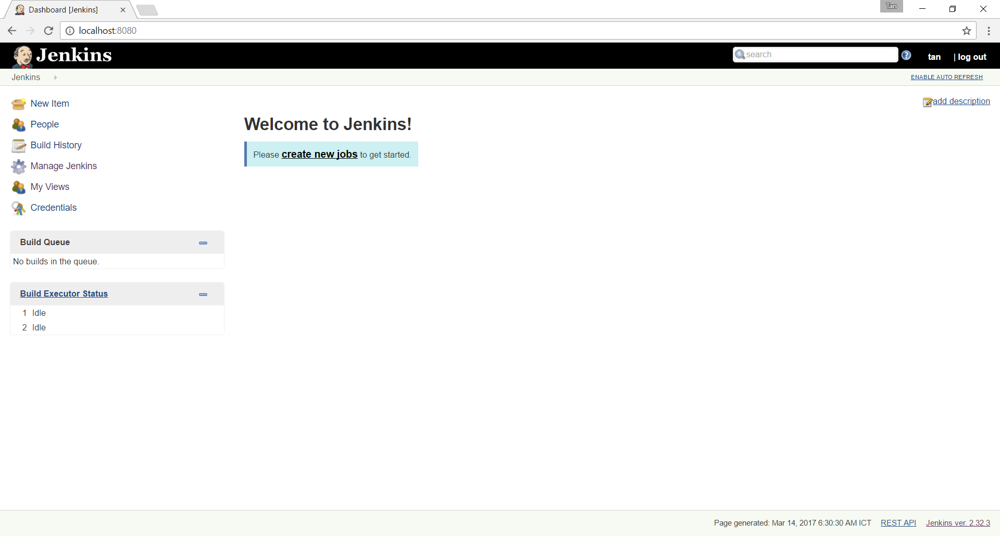
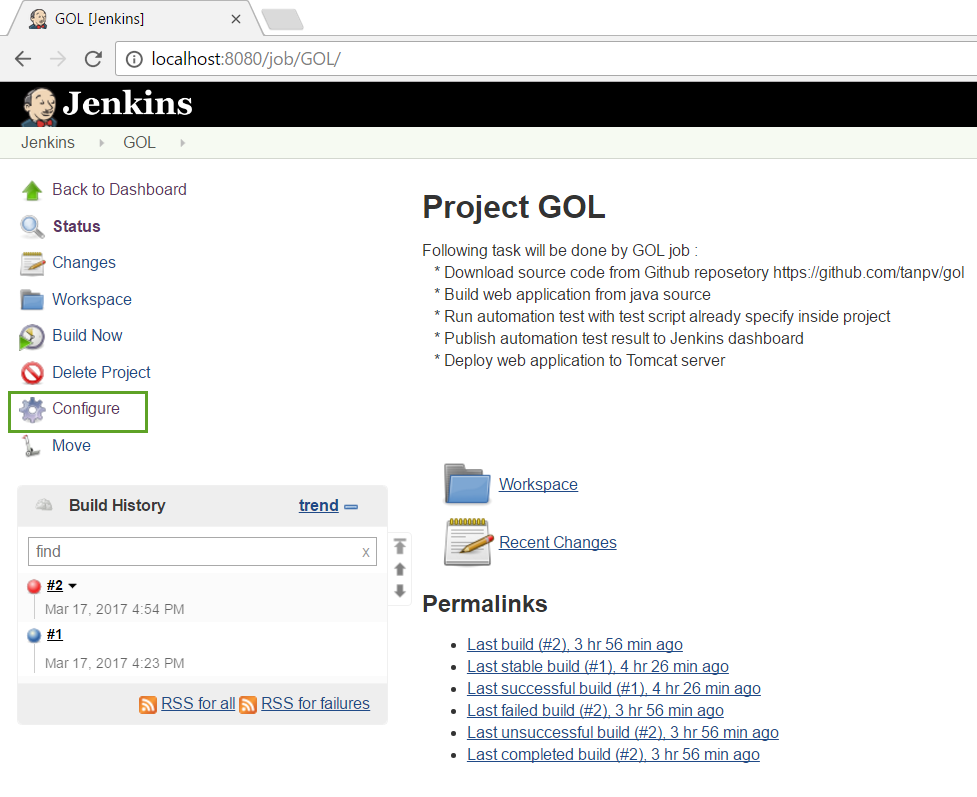
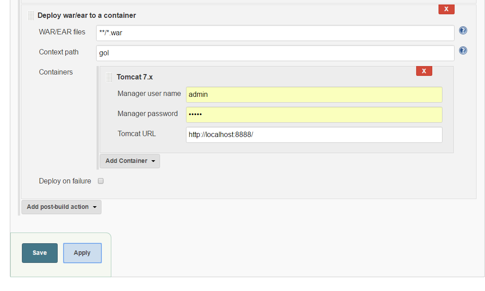
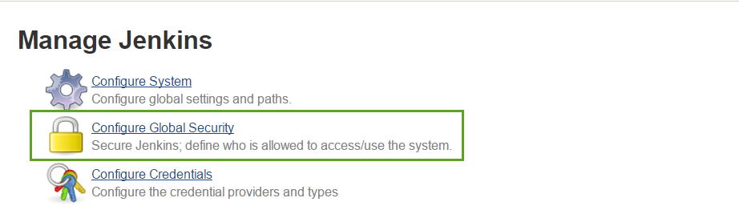
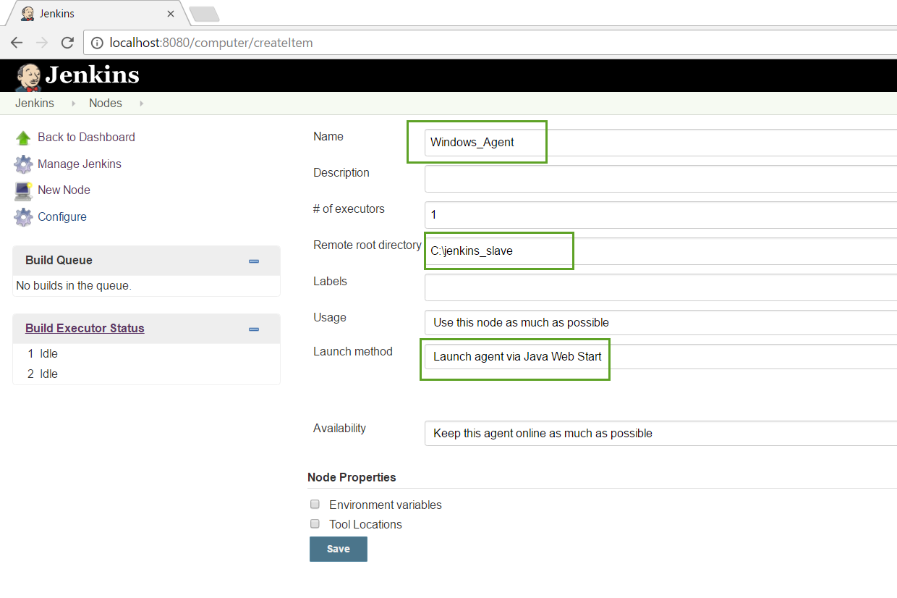
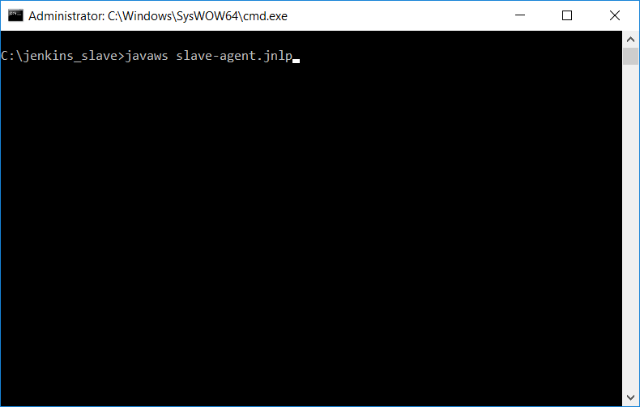
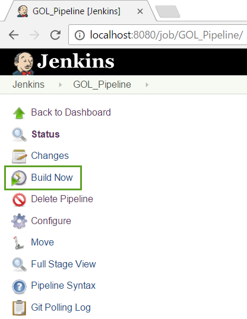
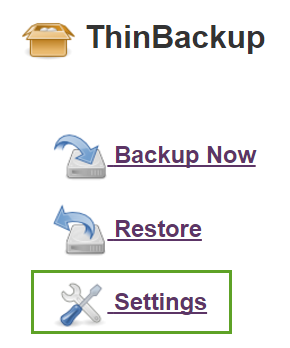
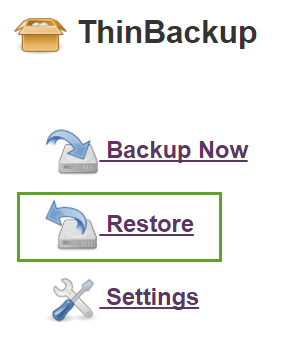

{width="6.267716535433071in" height="10.0in"}
====================================================================

Jenkins Installation
====================

In this chapter, we will jump into how to install and start up Jenkins
in 3 environment : Window, Ubuntu and Mac.

In all environment, Jenkins will be installed as service, it mean
Jenkins will automatically start up every time you machine power on or
restart machine.

Jenkins on Windows
------------------

**Check if java is installed** : Java should be installed in Windows
machine, to check if Java is installed, start a command prompt and
typing in ***java -version*** Java version show up as below. Incase java
not yet install, please install java before process to installation.

{width="3.1302088801399823in"
height="2.0969356955380576in"}

**Install process**

**Step 1** : Go to [****https://jenkins.io/****](https://jenkins.io/)
and download for stable version of Jenkins

{width="2.8090277777777777in"
height="1.4045144356955381in"}

**Step 2** : Create a new folder for Jenkins (for example
***C:\\Jenkins***) and put file ***jenkins.war*** inside this folder

{width="2.7147134733158356in"
height="1.5843547681539807in"}

**Step 3** : Press to shift and right click at same time to open context
menu and select ***Open command window here***

{width="2.807292213473316in"
height="2.563179133858268in"}

**Step 4** : Typing in command prompt following to start installation
***java -jar jenkins.war***

Then wait a while for complete running.

{width="3.1093755468066493in"
height="1.6757108486439196in"}

In the output log, you will see default password for first login of
admin user, copy this password to notepad and save it for use on next
step.

{width="3.6302088801399823in"
height="1.3369313210848643in"}

**Step 5** : Now open browser and access to
[****http://localhost:8080****](http://localhost:8080/) and then paste
admin password to unlock Jenkins

{width="3.619792213473316in"
height="1.9325174978127735in"}

Wait a while and following screen show up, select default option
***Install suggested plugins***

{width="3.713542213473316in"
height="1.9867443132108487in"}

At this step default plugins will be installed.

{width="3.7239588801399823in"
height="1.9924912510936132in"}

**Step 6** : Enter your user name, password for a new admin, then click
to ***Save and Finish***

{width="3.7968755468066493in"
height="2.0315748031496064in"}

**Step 7** : Click to ***Start using Jenkins***, Congregation at this
step you already complete for Jenkins installation

{width="3.787630139982502in"
height="2.0340977690288713in"}

Jenkins auto login by new admin user already created

{width="3.588542213473316in"
height="1.915757874015748in"}

**Step 8 :** Click to ***Manage Jenkins*** from main screen, scroll down
and click to ***Install as Windows Service***

{width="3.6927088801399823in"
height="1.9688167104111987in"}

Click to ***Install***

{width="3.6927088801399823in"
height="1.9738517060367453in"}

Click to ***Yes***

{width="3.8177088801399823in"
height="2.049711286089239in"}

Wait some time and you will see jenkins service is running from windows
service manager

{width="3.994792213473316in"
height="2.1427996500437447in"}

{width="4.026042213473316in"
height="2.1568077427821524in"}

That it, You complete install Jenkins on Windows as service. From now on
every time Windows power up or restart, Jenkins will ready to access at
[****http://localhost:8080****](http://localhost:8080)

You can try to login Jenkins with above user created.

{width="3.6302088801399823in"
height="1.9434448818897638in"}

Jenkins on Ubuntu
-----------------

**Check if java is installed**

Java should be installed in Ubuntu machine, to check if Java is
installed, start a terminal and typing in ***java -version ,*** If Java
already installed, you will see Java version show up.

{width="3.651042213473316in"
height="2.1767727471566056in"}

**Install Process**

**Step 1** : Open terminal and typing in following command

  -------------------------------------------------------------------------------------------------------------
  wget -q -O - https://pkg.jenkins.io/debian/jenkins-ci.org.key | sudo apt-key add -
  
  sudo sh -c 'echo deb http://pkg.jenkins.io/debian-stable binary/ &gt; /etc/apt/sources.list.d/jenkins.list'
  
  sudo apt-get update
  
  sudo apt-get install jenkins
  -------------------------------------------------------------------------------------------------------------

The above code do following job :

-   Jenkins will be launched as a daemon up on start. See
    > /etc/init.d/jenkins for more details.

-   The 'jenkins' user is created to run this service.

-   Log file will be placed in /var/log/jenkins/jenkins.log. Check this
    > file if you are troubleshooting Jenkins.

-   /etc/default/jenkins will capture configuration parameters for the
    > launch like e.g JENKINS\_HOME

-   By default, Jenkins listen on port 8080. Access this port with your
    > browser to start configuration.

**Step 2** : Open the file ***/var/log/jenkins/jenkins.log*** and copy
the default password which is automate generated during installation

{width="4.005208880139983in"
height="3.2367672790901136in"}

**Step 3** : Open browser and access to Jenkins at
[***http://localhost:8080/***](http://localhost:8080/) then paste the
password above to unlock jenkins. Click to ***Continue*** button

{width="4.161458880139983in"
height="2.0927569991251094in"}

**Step 4** : Click on ***Install suggested plugins***

{width="4.139176509186352in"
height="2.081597769028871in"}

{width="4.088542213473316in"
height="2.056132983377078in"}

**Step 5** : Enter your user name, password for a new admin.

{width="3.9660968941382326in"
height="2.123264435695538in"}

**Step 6** : That it, now jenkins ready to use, click to ***Start using
Jenkins***

{width="3.807292213473316in"
height="2.0371675415573054in"}

From now Jenkins already installed in Ubuntu as daemon service, so every
time you power on machine, Jenkins will start and ready to access at
[****http://localhost:8080/****](http://localhost:8080/)

Jenkins on Mac
--------------

**Step 1** : Download installer for Mac from
[*https://jenkins.io/*](https://jenkins.io/) .Then run the installer
file.

{width="4.09909230096238in"
height="2.2343755468066493in"}

**Step 2** : After complete install, you access Jenkins at
[****http://localhost:8080/****](http://localhost:8080/)

**Step 3 :** Open file
***/Users/Shared/Jenkins/Home/secrets/initialAdminPassword*** and copy
password use for unlock Jenkins

**Step 4** : Click on ***Install suggested plugins***

{width="3.994792213473316in"
height="2.0086811023622047in"}

{width="4.077656386701662in"
height="2.050347769028871in"}

**Step 5** : Enter your user name, password for a new admin.

{width="4.046875546806649in"
height="2.160952537182852in"}

**Step 6** : That it, now jenkins ready to use, click to ***Start using
Jenkins***

{width="4.098958880139983in"
height="2.1911482939632547in"}

From now Jenkins already installed in Mac as a service, so every time
you power on machine, Jenkins will start and ready to access at
[****http://localhost:8080/****](http://localhost:8080/)

Jenkins the Basic
=================

In this section I will explain Jenkins role in the world of continuous
integration, continuous delivery and devops. And then we will go through
steps in order to create “Hello World” Jenkins job.

Jenkins in the Big Picture of CI, CD and DevOps
-----------------------------------------------

{width="4.713542213473316in"
height="2.6658552055993in"}

Image above show quite clear about Jenkins role in software development
process.

-   Developer do coding and commit their code to a version control
    > repository like Github

-   Jenkins actively check Github to see any change, in case has code
    > change, Jenkins will pull the last code from Github to build
    > machine (machine which run Jenkins job)

-   Jenkins build software artifact from pulled source code (for example
    > war file from .java source file)

-   Jenkins run and show up unit test report

-   Jenkins deploy artifact to target environment (for example a web
    > server like : Tomcat, JBoss, WebSphere...)

Create “Hello world” Job
------------------------

From Jenkins home page, click to **New Item**

{width="1.4417705599300088in"
height="2.213542213473316in"}

In create project page, typing in “Hello World” to project name, select
**Freestyle project** and then click to save button.

{width="3.9843755468066493in"
height="3.1300251531058616in"}

Add Build Step
--------------

In configure job page, select **Build** tab, click to **Add build step**
and select **Execute Windows batch command** (in case you are using
Linux please select **Execute shell**)

{width="3.7343755468066493in"
height="3.0324245406824146in"}

Typing in command “echo Hello World”. The purpose of this job is just
echo to log message “Hello World” text.

{width="3.712933070866142in"
height="1.328125546806649in"}

Click **Save** button and we complete the first job!

Start the First Build
---------------------

From job dashboard, click **Build Now** and you will see job run. This
job just do one thing, invoke the command “echo hello world”

{width="3.838542213473316in"
height="3.5996992563429573in"}

{width="3.7968755468066493in"
height="3.3656036745406825in"}

Console Output
--------------

Now job run completely, click to build number and select **Console
Output.** You will see message “Hello World” show up inside build log.
That it you just complete the first Jenkins job.

{width="3.6302088801399823in"
height="3.8935990813648296in"}

{width="3.682292213473316in"
height="1.751576990376203in"}

Intro GOL Demo Project (a Java Maven Project)
=============================================

In this book, project called GOL (game of life) is used to express the
features related to Jenkins. So it will be helpful to review some
information related to this project.

Github Repository
-----------------

GOL project is hosted on Github at
[*https://github.com/tanpv/gol*](https://github.com/tanpv/gol). Please
**fork** to your Github account so you can try Jenkins features by
yourself later.

{width="6.267716535433071in"
height="0.6944444444444444in"}

Maven Pom File Structure
------------------------

This section show you POM file from project GOL above

Download GOL project from Github to your local and unzip.

{width="4.381683070866142in"
height="2.6927088801399823in"}

From eclipse open GOL project from unzipped directory. Open POM file you
will see how project is structured.

{width="4.473958880139983in"
height="3.2125043744531934in"}

{width="4.609375546806649in"
height="3.2465277777777777in"}

Install maven to your local and you can try to build this project
manually by command

{width="3.9427088801399823in"
height="1.893597987751531in"}

Wait a while you can see output of the build as web application **war**
file inside folder **C:\\gol-master\\gameoflife-web\\target**

{width="4.276042213473316in"
height="2.1309175415573054in"}

How GOL Look Like after Deploy to Application Server
----------------------------------------------------

Deploy this application to Tomcat server, and you will see some the app
from browser and actually start a new game !.

{width="4.234375546806649in"
height="1.0705413385826772in"}

{width="4.291601049868766in"
height="1.140625546806649in"}

Continuous Integration with Jenkins
===================================

This chapter will show you how to automate software build with Jenkins.

Create GOL Job
--------------

From home page, click to ***New Item*** link

{width="4.161458880139983in"
height="2.2340463692038495in"}

Enter ***GOL*** for project name and then chose ***Freestyle project***
and finally click to ***OK*** button to create a new job with name is
***GOL***

{width="3.8177088801399823in"
height="2.0443208661417325in"}

Then a new screen will show up allow us to configure everything for
**GOL** job.

{width="3.838542213473316in"
height="2.064425853018373in"}

***Description*** is place to describe what mission of this job and
steps inside the job. Put follow text into ***Description*** session.

“ Following task will be done by GOL job :

-   Download source code from Github repository
    > [*https://github.com/tanpv/gol*](https://github.com/tanpv/gol)

-   Build web application from java source

-   Run automation test with test script already specify inside project

-   Publish automation test result to Jenkins dashboard

-   Deploy web application to Tomcat server ”

{width="3.9843755468066493in"
height="1.0359372265966753in"}

Source Code Management
----------------------

Purpose of this part is answer for question ***Where to get source code
?*** for our software build. From job configure, click into ***Source
Code Management*** tab

{width="4.234375546806649in"
height="0.9644455380577428in"}

### Check if git is installed in local machine

In order to clone source code from Github, local machine should install
Git.

To check if local machine already install **git** or not, open command
prompt and typing

**git --help**

{width="4.286458880139983in"
height="2.47869094488189in"}

To download and install git, please refer to this link
[*https://git-scm.com/downloads*](https://git-scm.com/downloads)

### Specify source code repository

Because we host project source code on Github, so you will choose
***Git*** as below.

{width="3.6718755468066493in"
height="2.376370297462817in"}

To get repo link, go to Github
[*https://github.com/tanpv/gol*](https://github.com/tanpv/gol) then
click to ***Clone or download*** button, you will see the repo link.
Copy this link.

{width="3.776042213473316in"
height="2.027477034120735in"}

Put the repo link ****<https://github.com/tanpv/gol.git>**** in to
***Repository URL*** section. The branch will be default as
***\*/master***

{width="3.9385444006999126in"
height="2.557292213473316in"}

Click to ***Save*** button and that it, we already tell to Jenkins where
to get source code.

### Check if setting working fine

This is the time to try for first running and see if source code from
Github is clone or not.

Go back to home page then click to GOL job

{width="4.0801531058617675in"
height="1.5260422134733158in"}

The dashboard for GOL will show up, you will see describe which we just
added before

{width="4.005208880139983in"
height="2.6519925634295713in"}

Click in to ***Build Now*** to activate job run immediately.

{width="1.8830074365704288in"
height="2.9427088801399823in"}

You will see GOL start running as expected

{width="3.244792213473316in"
height="1.7156364829396324in"}

To see how job running, select ***Console Output*** from context menu
while you click to build number

{width="2.356350612423447in"
height="2.213542213473316in"}

Then the job log will show up every thing happen in order to clone
source code from Github repository. You can see that the build already
success running.

{width="3.8672200349956256in"
height="2.1406255468066493in"}

Now we could go to local repository to see the source code already
downloaded. Each job will have it’s own folder inside **workspace**
folder

{width="3.872221128608924in"
height="2.651042213473316in"}

That it, we complete the first step of this job.

Build Triggers
--------------

{width="3.7864588801399823in"
height="2.9830107174103238in"}

The first way and most simple way to start LOG job is just click in to
***Build Now*** button. But this way is manually and not so cool. We
want to trigger Jenkins job running automatically, so to do this, click
to ***Configure*** from LOG dashboard.

{width="4.001031277340332in"
height="3.2552088801399823in"}

Then select to ***Build Triggers*** tab you will some option to
configure so job could trigger automatically

{width="4.036458880139983in"
height="1.1365594925634295in"}

Have 5 ways to automate trigger Jenkins job as show above. In this book
I will focus on **Poll SCM,** the good way in configure for a continuous
system. Now you click on **Poll SCM,** you will see a text box show up
for setting schedule

{width="3.9218755468066493in"
height="1.813867016622922in"}

So following are steps show up how ***Poll SCM*** work :

-   Base on schedule setting, Jenkins will actively check Github
    > repository to see if have any change from repository

-   If have any change on Github repo Jenkins job will trigger

{width="4.050750218722659in"
height="2.1302088801399823in"}

Schedule with ***Poll SCM*** work follow cron schedule rule, above image
show some cron schedule example. Basically, we want to catch the change
on Github repository as soon as possible, so follow text will be add to
***Schedule*** \* \* \* \* \* . This mean we want to check change on
Github every minute !

{width="4.255208880139983in"
height="2.207290026246719in"}

Click to **Save** and Jenkins will move you back to job dashboard

{width="4.203125546806649in"
height="1.141832895888014in"}

Now is the time to check if this setting really work ?

I will go to my GOL project repo on Github and change content of file
***README.markdown*** right from web browser (Github support commit
change right from web browser)

{width="3.9218755468066493in"
height="1.9340748031496062in"}

{width="3.9843755468066493in"
height="1.9610597112860892in"}

{width="4.046875546806649in"
height="1.696819772528434in"}

Now come back to job dash board, wait for about 1 minute, you will see
new job is planning and run.

{width="4.30879593175853in"
height="3.307292213473316in"}

That it, it work !!!, to practice by yourself, just clone GOL project to
your account by **Fork** button and then change the GOL configuration
point to your github account as show below.

{width="4.130208880139983in"
height="1.4490594925634295in"}

{width="4.151042213473316in"
height="2.2175721784776905in"}

Build
-----

In this section, We will setting to build java web app with maven.

### Maven installation

First step, maven should be installed in machine witch running Jenkins
job. To check this, just open command prompt and typing in ***mvn --help
,*** you will some all available maven command.

{width="4.902673884514436in"
height="2.8281255468066493in"}

In case maven not yet install follow these steps to do maven
installation (for Window)

-   Download maven from link
    > [*http://maven.apache.org/download.cgi*](http://maven.apache.org/download.cgi)

> {width="4.432292213473316in"
> height="1.1659416010498687in"}

-   Unzip zip file to one folder (for example I unzip to
    > C:\\apache-maven-3.3.9)

> {width="3.2968755468066493in"
> height="2.2671008311461067in"}

-   Add M2\_HOME and MAVEN\_HOME variable point to above foder

> {width="3.119792213473316in"
> height="3.4295581802274717in"}

-   Add mavin bin to Path variable so you can call maven from any place

> {width="3.1927088801399823in"
> height="3.531887576552931in"}

That it, to check maven installed successfully, open cmd and typing in
***mvn --help***

Help content for mvn should show up correctly

{width="4.046875546806649in"
height="2.336339676290464in"}

### Try to run maven build manually

Now maven is ready, we can try to run the build for source code which we
just clone from Github repository at **source code management** step.

Open **cmd** and change directory to repository GOL folder. And then
typing in **mvn install**

This command will run java source unit test and then build this web
application to a .war file

{width="4.067708880139983in"
height="2.2251574803149605in"}

You will build result from command prompt

{width="4.088542213473316in"
height="1.5445603674540682in"}

And can see actual .war file inside target folder of **gameoflife-web.**
This folder could be use to deploy with web application server.

{width="4.067708880139983in"
height="2.5646095800524935in"}

### Configure Build Step

From GOL job dashboard, click to **Configure** link, the configure page
will show up

{width="4.078125546806649in"
height="3.4830336832895887in"}

From configure page, select **Build** tab, page will scroll down to
**Add build step**

{width="4.171875546806649in"
height="3.2836690726159232in"}

Click to **Add build step** and select **Invoke top-level Maven
targets**

{width="4.088542213473316in"
height="2.0943536745406823in"}

Section to adding maven command will show up as below

{width="4.130208880139983in"
height="1.0687817147856518in"}

Put **Goals** maven command **clean install**

{width="4.046875546806649in"
height="0.9914391951006124in"}

Then finally click in to **Save** button. That it we already complete
configure for build maven step.

### Check Log and Workspace

Now from dashboard of GOL, just click to **Build Now** to see how
Jenkins job work by open console log

{width="2.1997331583552056in"
height="2.2343755468066493in"}

Scroll this log to bottom you will see build job run successfully

{width="3.496053149606299in"
height="2.7864588801399823in"}

From GOL home page, click to **Workspace**

{width="1.4739588801399826in"
height="2.7046423884514437in"}

You will access directory where build happen and actually could see the
war file inside **Gameoflife-web/target/.** You could actually download
war file from here.

{width="3.956836176727909in"
height="2.057292213473316in"}

That it, We already finish setting up build step.

Continuous Inspection with Jenkins
==================================

Job Configure for Test Report
-----------------------------

From job dashboard, click to **Configure.** Because showing unit test
result on dashboard is done after job build successfully, so we click to
tab **Post-build Actions.**

{width="3.730469160104987in"
height="2.9843755468066493in"}

Click to **Add post-build action,** from dropout menu, select **Publish
JUnit test result report**

{width="2.182292213473316in"
height="2.125923009623797in"}

Input path to maven test result **\*\*/target/surefire-reports/\*.xml**

{width="3.588542213473316in"
height="1.3618569553805775in"}

Click **Save** button to finish configure

Test Report on Job Dashboard
----------------------------

From job dashboard, click to **Build Now.** After job run successfully,
you will see a link lead to test result. Click to **Latest Test Result**

{width="3.1278193350831147in"
height="2.7864588801399823in"}

The test report show up, from here you can see many statistic related to
test.

{width="4.161458880139983in"
height="1.2587707786526685in"}

Continue run second time, you will see a chart on job dash board which
show up how trending in test result or changing from build to build.

{width="4.140625546806649in"
height="1.9273731408573929in"}

Continuous Delivery with Jenkins
================================

This session will show you how to deploy web application (.war file) to
a Tomcat web server.

Install Tomcat Server as Service
--------------------------------

To install Tomcat 7 server, you just following these steps:

-   Download Tomcat 7 from this page
    > [*http://tomcat.apache.org/download-70.cgi*](http://tomcat.apache.org/download-70.cgi)
    > , note that we will download version [*Windows Service
    > Installer*](http://www-eu.apache.org/dist/tomcat/tomcat-7/v7.0.76/bin/apache-tomcat-7.0.76.exe)
    > so Tomcat will be installed as window service

> {width="3.2406080489938756in"
> height="2.088542213473316in"}

-   Run installer and select port 8888 for running Tomcat (We already
    > use 8080 for Jenkins installation)

> {width="2.432292213473316in"
> height="2.001479658792651in"}
>
> {width="3.8599201662292213in"
> height="3.1614588801399823in"}

-   After install successfully, a Tomcat service will running and you
    > can access Tomcat server from localhost

> {width="3.869792213473316in"
> height="0.9143416447944007in"}
>
> {width="3.6302088801399823in"
> height="1.2802963692038496in"}

-   To control Tomcat from Jenkins, one user with role “manager-script”
    > should be added to file **conf\\tomcat-users.xml .** Then restart
    > Tomcat server by service.

> {width="3.7635378390201226in"
> height="2.057292213473316in"}
>
> {width="3.713542213473316in"
> height="1.3806758530183727in"}
>
> To check if admin user working, access to
> [*http://localhost:8888/manager/text/list*](http://localhost:8888/manager/text/list)
> and then put on user / password you just specify
>
> {width="3.7968755468066493in"
> height="1.515226377952756in"}

Install “Deploy to Container Plugin”
------------------------------------

In order to deploy war file in Tomcat server, we need to install “Deploy
to Container Plugin”.

From Jenkins home page, click to **Manage Jenkins**

{width="2.1830818022747156in"
height="3.2031255468066493in"}

Then click to **Manage Plugin**

{width="3.8906255468066493in"
height="3.2997594050743655in"}

Click to tab **Available,** typing “Deploy to Container Plugin”, then
click to **Install without restart** button

{width="3.932292213473316in"
height="0.943076334208224in"}

After install you will see it show up inside **Installed** tab

{width="3.9218755468066493in"
height="1.5129647856517936in"}

Add Deploy Step
---------------

Open GOL job configuration, click to “**Post-build Actions**” tab, click
to “**Add post-build action**”, and select item “**Deploy war/ear to a
container**” from context menu

{width="4.432292213473316in"
height="3.2469116360454944in"}

Select “Tomcat 7.x” from **Containers**

{width="4.890625546806649in"
height="2.1780107174103236in"}

Input path to **war file**, input **context path**, and finally input
**admin user/password** which already created at step install Tomcat
server.

{width="4.869792213473316in"
height="2.914955161854768in"}

Finally click to **Save** button.

Check if Deploy Step Run Successfully
-------------------------------------

From GOL job dashboard, click into **Build Now,** wait some time until
job complete and you will see consolog for step deploy GOL to Tomcat
server

{width="6.267716535433071in"
height="0.7222222222222222in"}

And now you try to access GOL web app at
[*http://localhost:8888/gol/*](http://localhost:8888/gol/)

{width="4.651042213473316in"
height="1.5142924321959754in"}

That it, deployment step working fine now. And the great thing is you
know you are testing on what build on Jenkins.

Continuous Monitoring with Jenkins
==================================

Create Slack Team and Install Jenkins CI App
--------------------------------------------

From Slack, create a new team call **jenkins-demo**

{width="3.9114588801399823in"
height="1.670518372703412in"}

Create a new channel call **\#build,** this channel will be used to
notify message from Jenkins

{width="1.796875546806649in"
height="2.6424628171478566in"}

From **jenkins-demo** home page, click to **Add an app or integration**

{width="2.927179571303587in"
height="2.3177088801399823in"}

Search for **Jenkins CI** application

{width="3.9427088801399823in"
height="1.7234109798775152in"}

Click to **Install** button

{width="1.557759186351706in"
height="2.963542213473316in"}

Select **\#build** and click **Add Jenkins CI integration**

{width="4.348958880139983in"
height="1.7338035870516186in"}

Copy information related to team domain and token, this information will
be use to configure Jenkins job later

{width="4.359375546806649in"
height="2.149413823272091in"}

Install Slack Notification Plugin to Jenkins
--------------------------------------------

Go to **Plugin Manager** and install **Slack Notification** plugin

{width="4.328125546806649in"
height="0.7939741907261593in"}

Go to **Manage Jenkins,** click to **Configure System**

{width="2.6718755468066493in"
height="0.5163440507436571in"}

Search for section **Global Slack Notifier Settings,** and put in
information for **Team Subdomain** and **Integration Token** (This infor
get from previous step ), then click to **Test Connection,** you will
see connection successfully. Finally click to **Save** button.

{width="4.307292213473316in"
height="1.1431244531933509in"}

That it, now Slack notification is ready used inside Jenkins job.

Configure GOL Using Slack Notification
--------------------------------------

From Jenkins home page, click to **Configure** of GOL job

{width="2.244792213473316in"
height="2.141819772528434in"}

From **Configure** page, click to tab **Post-build Actions,** then add a
**Slack Notifications** step.

{width="2.2858595800524935in"
height="2.5468755468066493in"}

Select when the notify will be send

{width="1.9322922134733158in"
height="2.5299081364829394in"}

Click to **Advanced** and put information for **Team Subdomain** and
**Integration Token.** Finally click to **Save** button.

{width="4.723958880139983in"
height="1.9068471128608924in"}

Check if Notification Work
--------------------------

From GOL home page click to **Build Now**

{width="1.4322922134733158in"
height="0.3182874015748032in"}

And notification message will be send to **\#build** channel as expected

{width="3.088542213473316in"
height="1.0384656605424323in"}

That it, from now on, GOL build and deploy job will be automatically
watched by Slack Notification.

Distributed Build System with Jenkins
=====================================

Jenkins Architecture
--------------------

{width="4.598958880139983in"
height="1.6497265966754155in"}

Normally, job will do not run on machine which install Jenkins but
running on slave machines and these slaves machine are controlled by
master machine where Jenkins is installed.

Windows Slave Agent
-------------------

### Enable Launch Slave Agents via Java Web Start

From Jenkins home page, click to ***Manage Jenkins***

{width="1.8785487751531058in"
height="2.838542213473316in"}

Then click to ***Configure Global Security***

{width="6.267716535433071in" height="1.75in"}

Select ***Random*** for option ***TCP port for JNLP agents***

{width="4.057292213473316in"
height="1.3804122922134734in"}

Then finally click ***Save*** button

### Add New Windows Slave

From Jenkins home page, click to ***Manage Jenkins***

{width="1.8785487751531058in"
height="2.838542213473316in"}

On ***Manage Jenkins*** page, scroll down and click to ***Manage
Nodes***

{width="4.026042213473316in"
height="2.4572080052493437in"}

From there you can see all computer currently exist in system. We just
have one master machine. To create new node, click to ***New Node***

{width="4.223958880139983in"
height="1.2068449256342957in"}

Input agent name and click to **OK** button

{width="3.8906255468066493in"
height="1.1527777777777777in"}

Input ***Remote root directory*,** select ***Launch agent via Java Web
Start,*** Finally click to ***Save*** button

{width="3.7864588801399823in"
height="2.518266622922135in"}

### Launch Slave Agent

From computer which we want to install as slave ( for demo, I use same
machine for both master and slave) access to link
[*http://localhost:8080/computer/*](http://localhost:8080/computer/)

You could see that currently Window\_Agent is disconnected with Jenkins.

{width="4.223958880139983in"
height="1.436917104111986in"}

Click to ***Windows\_Agent*** and then click to ***Launch*** button

{width="4.276042213473316in"
height="1.1861286089238845in"}

File ***slave-agent.jnlp*** will be downloaded to local, copy this file
to ***C:\\jenkins\_slave***

{width="3.7133245844269465in"
height="1.8489588801399826in"}

Start a command prompt as administrator.

{width="2.0264173228346456in"
height="2.8906255468066493in"}

Change directory to ***C:\\jenkins\_slave*** then execute command
***javaws slave-agent.jnlp***

{width="2.9218755468066493in"
height="1.847536089238845in"}

A dialog will show up, click to ***Run*** button

{width="2.9114588801399823in"
height="1.831712598425197in"}

A dialog will show up and message that connected successfully

{width="2.932292213473316in"
height="1.5193722659667541in"}

Go back to link
[*http://localhost:8080/computer/*](http://localhost:8080/computer/) and
refresh, you will see Window\_Agent up and running successfully.

{width="4.671875546806649in"
height="1.5821095800524934in"}

Now Window\_Agent ready for use. But we will do one more step to setting
up slave agent as a Windows service. From ***Jenkins slave agent***
dialog, click to ***File*** and then select ***Install as a service***

{width="3.2343755468066493in"
height="1.6636340769903761in"}

Then click ***OK*** for question

{width="6.267716535433071in"
height="0.5416666666666666in"}

Current dialog will close up and new service for slave agent is
installed successfully.

{width="4.838542213473316in"
height="1.2626476377952756in"}

From now on, everytime machine power up, this machine will automatically
connect to jenkins master and ready for running job.

### Running Job with Windows Slave Agent

From GOL job dashboard, click to ***Configure***

{width="1.890625546806649in"
height="2.6015627734033244in"}

From ***General*** tab, click to ***Restrict where this project can be
run,*** then enter “Windows\_Agent” in ***Label Expression***. This mean
we only want GOL job running on machine represented by “Windows\_Agent”
. Then finally click to ***Save*** button.

{width="4.109375546806649in"
height="3.0700010936132984in"}

Now try to run GOL from it’s dashboard by click on **Build Now**

From Jenkins home page, you could see GOL running with
**Windows\_Agent** machine

{width="2.147818241469816in"
height="3.9427088801399823in"}

Ubuntu Slave Agent
------------------

### Enable Launch Slave Agents via Java Web Start

### Add New Ubuntu Slave Agent

From jenkins home page, click to **Manage Jenkins,** then click to
**Manage Nodes**

{width="1.8341130796150482in"
height="2.6614588801399823in"}

{width="6.267716535433071in"
height="0.5833333333333334in"}

From **Nodes** screen, click to **New Node**

{width="2.818627515310586in"
height="2.276042213473316in"}

### 

Put the name “Ubuntu\_Agent”, click to **Save** button

{width="4.619792213473316in"
height="0.9612303149606299in"}

Specify **Remote root directory,** then click **Save** button

{width="4.64246062992126in"
height="3.7864588801399823in"}

### Launch Slave Agent

Go to Ubuntu machine which you want it become a jenkins agent and click
to **Ubuntu\_Agent**

{width="1.9752023184601926in"
height="3.213542213473316in"}

Click to **Launch** button

{width="4.338542213473316in"
height="0.8387849956255468in"}

Click to **OK** button

{width="2.878086176727909in"
height="1.9427088801399826in"}

One dialog will show up that agent and master already connect

{width="1.8960728346456692in"
height="1.328125546806649in"}

Now you will see **Ubuntu\_Agent** up and running from Jenkins home
page. And you could create job which need to running on Ubuntu machine.

{width="2.6170089676290464in"
height="2.0468755468066493in"}

Jenkins Pipeline
================

What is Jenkins Pipeline ?
--------------------------

Jenkins Pipeline is a suite of plugins which supports implementing and
integrating continuous delivery pipelines into Jenkins. Pipeline
provides an extensible set of tools for modeling simple-to-complex
delivery pipelines "as code" via the [*Pipeline
DSL*](https://jenkins.io/doc/book/pipeline/syntax/).

Following are common steps to use pipeline:

-   Create a **Jenkinsfile** which describe what kind of command with
    > run while pipeline running.

-   Add this **Jenkinsfile** to the root of project on Github
    > repository. **Jenkinsfile** use Groovy grammar.

-   Create a new job with type **Pileline**

-   Run pipeline job

Create a Jenkinsfile
--------------------

From your local machine, create a new file with name **Jenkinsfile**

{width="3.276042213473316in"
height="2.5052088801399823in"}

Put following code into **Jenkinsfile,** this code basically will run
maven command to build web application.

+-----------------------------------------------------------------------+
| // start of pipeline                                                  |
|                                                                       |
| pipeline {                                                            |
|                                                                       |
| // where pipeline job will run\                                       |
| agent any                                                             |
|                                                                       |
| // start of stages : build, test, deploy ...\                         |
| stages {                                                              |
|                                                                       |
| // start of stage : build\                                            |
| stage('build') {                                                      |
|                                                                       |
| // start of running steps inside one stage\                           |
| steps {                                                               |
|                                                                       |
| // invoke command to build with maven\                                |
| bat 'mvn clean install'\                                              |
| }\                                                                    |
| }\                                                                    |
| }\                                                                    |
| }                                                                     |
+-----------------------------------------------------------------------+

Access to GOL github repo from browser, click to **Upload files,** then
drag drop **Jenkinsfile** which already created. Finally click to
**Commit changes**

{width="3.6718755468066493in"
height="2.1637839020122485in"}

{width="3.7656255468066493in"
height="2.1026334208223973in"}

Wait some time and you will see the file show up inside GOL repository

{width="3.5781255468066493in"
height="2.2967027559055118in"}

Create Pipeline Job
-------------------

From Jenkins home page click to **New Item**

{width="2.0052088801399823in"
height="2.4191272965879267in"}

Typing job name GOL\_Pileline, select **Pipeline** job style, and click
to **Save** button

{width="3.670326990376203in"
height="2.901042213473316in"}

From job dashboard GOL\_Pipeline, click to **Configure**

{width="3.2389884076990376in"
height="2.8802088801399823in"}

Select **Build Triggers** tab, select **Post SCM** check box, then put
in following string to check change every minute on github “**\* \* \*
\* \***”

{width="3.2552088801399823in"
height="1.407399387576553in"}

Select **Pipeline** tab, then select **Pipeline script from SCM**

{width="3.4218755468066493in"
height="2.1289501312335957in"}

From **SCM** dropbox, select **Git,** then put in GOL project repository
url
[*https://github.com/tanpv/gol.git*](https://github.com/tanpv/gol.git) ,
finally click to **Save** button.

{width="2.8489588801399823in"
height="1.8595002187226597in"}

That it, we already complete create the first pipeline job with Jenkins!

Build with Pipeline
-------------------

From GOL dashboard, click to **Build Now**

{width="1.8944444444444444in"
height="2.4218755468066493in"}

You will see job run with quite nice progress show up

{width="3.5156255468066493in"
height="2.2690879265091866in"}

Click to **Console Log,** build log will show up with build success for
GOL project.

{width="2.5732338145231846in"
height="1.984375546806649in"}

{width="3.6718755468066493in" height="2.084300087489064in"}
----------------------------------------------------------------------------------

Running Pipeline On Specific Agent
----------------------------------

Edit **Jenkinsfile** on Github with following content, basically this
code will force pipeline to only running on Windows\_Agent

  -----------------------------------------------------
  // start of pipeline\
  pipeline {\
  // where pipeline job will run\
  agent {\
  // force pipeline job to running on windows\_agent\
  label "Windows\_Agent"\
  }\
  // start of stages : build, test, deploy ...\
  stages {\
  // start of stage : build\
  stage('build') {\
  // start of running steps inside one stage\
  steps {\
  // invoke command to build with maven\
  bat 'mvn clean install'\
  }\
  }\
  }\
  }
  -----------------------------------------------------

Click to **Commit changes**

{width="4.130208880139983in"
height="1.483167104111986in"}

You will see GOL\_Pipeline automatically run due to it saw code change
from Github

{width="4.192573272090988in"
height="2.651042213473316in"}

And from **Console Output,** you can see that GOL\_Pipeline job is
running with “Windows\_Agent”

{width="4.171875546806649in"
height="1.4975962379702537in"}

Deploy to Tomcat with Pipeline
------------------------------

Edit **Jenkinsfile** on GOL repository with following code, this code
add deployment to Tomcat server step.

+-----------------------------------------------------------------------+
| // start of pipeline\                                                 |
| pipeline {                                                            |
|                                                                       |
| // where pipeline job will run\                                       |
| agent {\                                                              |
| // force pipeline job to running on windows\_agent\                   |
| label "Windows\_Agent"\                                               |
| }                                                                     |
|                                                                       |
| // start of stages : build, test, deploy ...\                         |
| stages {                                                              |
|                                                                       |
| // start of build stage\                                              |
| stage('build') {\                                                     |
| // define step to run\                                                |
| steps {\                                                              |
| // invoke command to build with maven\                                |
| bat 'mvn clean install'\                                              |
| }\                                                                    |
| }                                                                     |
|                                                                       |
| // start of deploy state\                                             |
| stage('deploy') {\                                                    |
| // define step to run\                                                |
| steps {\                                                              |
| //invoke command to stop tomcat service\                              |
| bat 'sc stop Tomcat7'\                                                |
| bat 'ping 127.0.0.1 -n 6'\                                            |
| // copy war file from build target to webapp Tomcat folder\           |
| bat 'xcopy /y                                                         |
| C:\\\\jenkins\_slave\\\\workspace\\\\GOL\_Pipeline\\\\gameoflife-web\ |
| \\\target\\\\gameoflife.war                                           |
| "C:\\\\Program Files\\\\Apache Software Foundation\\\\Tomcat          |
| 7.0\\\\webapps"'\                                                     |
| //invoke command to start tomcat service\                             |
| bat 'sc start Tomcat7'\                                               |
| }\                                                                    |
| }\                                                                    |
| }\                                                                    |
| }                                                                     |
+-----------------------------------------------------------------------+

Commit change of **Jenkinsfile** to Github right from browser

{width="4.463542213473316in"
height="1.594121828521435in"}

Wait for about 1 minute and GOL\_Pipeline job will automatically build

{width="4.453125546806649in"
height="2.3745067804024496in"}

From **Console Output** will see deploy to Tomcat7 step

{width="3.838542213473316in"
height="1.2046489501312336in"}

Check the site and you will see it work fine at
[*http://localhost:8888/gol*](http://localhost:8888/gol)

{width="4.546875546806649in"
height="1.5785662729658794in"}

Jenkins Security
================

Create gol\_developer user
--------------------------

From **Manage Jenkins,** click to **Manage Users**

{width="3.5989588801399823in"
height="0.4440277777777778in"}

Click to **Create User**

{width="2.838542213473316in"
height="2.085459317585302in"}

Add information for new user

{width="2.5781255468066493in"
height="1.8981146106736657in"}

Then new user is created

{width="2.9531255468066493in"
height="0.6042694663167104in"}

Matrix-based Security
---------------------

Click **Configure Global Security**

{width="3.744792213473316in"
height="0.41991251093613297in"}

Click to **Matrix-based security**

{width="3.1145833333333335in"
height="0.3541666666666667in"}

Setting all permission for **your user,** and try to setting for user
**gol\_developer** overall read and job read permission. Finally click
to **Save** button.

{width="1.1510422134733158in"
height="1.3964840332458444in"}

Logout from your account, then try to login with **gol\_developer**
user. Now GOL\_developer could read the jobs only.

{width="4.869792213473316in"
height="2.380123578302712in"}

Role-based Security
-------------------

### Install Role-based Plugin

From home page click to **Manage Jenkins,** then **Manage Plugin. **

{width="1.8432163167104112in"
height="0.3489588801399825in"}

{width="2.744792213473316in"
height="0.5085936132983377in"}

At **Manage Plugin** page, select tab **Available,** then typing into
filter **Role-based Authorization Strategy**, click to **Install without
restart **

{width="4.286458880139983in"
height="0.7191568241469817in"}

### Configure Global Role

From **Manage Jenkins,** configure to **Configure Global Security,** and
then at session **Authorization** select **Role-based Strategy** option.
Then click to **Save** button.

{width="2.5062325021872267in"
height="1.5989588801399826in"}

Now from **Manage Jenkins,** you will see new item call **Manage and
Assign Roles**

{width="4.036458880139983in"
height="0.4036461067366579in"}

Click to **Manage and Assign Roles,** UI allow to **Manage Roles and
Assign Roles** will show up

{width="4.057292213473316in"
height="2.425136701662292in"}

Click to **Manage Roles,** at **Global roles,** add **dev** role with
read permission at **Overall** and full permission with Job, then click
to **Save**

{width="4.255208880139983in"
height="0.5907447506561679in"}

Back to screen **Manage Roles and Assign Roles,** then click to **Assign
Roles.** Now assign GOL\_Developer to **dev** role. Click to **Save**

{width="2.452334864391951in"
height="1.421875546806649in"}

That it, now try to logout from Jenkins and login with user
GOL\_developer. You will see GOL\_developer could see all the job, but
could not see **Manage Jenkins**

{width="3.9531255468066493in"
height="1.5259241032370954in"}

### Configure Project Role

Currently, GOL\_developer could see and access all jobs, You want to
configure so GOL\_developer only could see GOL project.

From **Manage and Assign Roles** screen, click to **Manage Roles**, at
**Project roles** section, add GOL

{width="4.682292213473316in"
height="1.1153094925634295in"}

And then select all permission for GOL role. Click **Save** button.

{width="4.182292213473316in"
height="0.4565824584426947in"}

From **Global roles** section, remove all permission related to job and
only keep overall read permission.

{width="4.078125546806649in"
height="1.0517793088363954in"}

Now come back to **Assign Role** screen, then at the **Project Role**
section, add GOL\_developer user, and select GOL role for this user.
Save configure.

{width="2.088542213473316in"
height="1.1879068241469817in"}

Logout from your admin and login back with GOL\_developer. Now you can
see that GOL\_developer only see GOL project.

{width="4.765625546806649in"
height="0.8153805774278216in"}

Disable Security
----------------

In some case, you do not need any security (like a personal build
system), you just want to disable Jenkins security. To do this, go to
place where Jenkins is installed, edit file **config.xml**

{width="4.166272965879265in"
height="3.0989588801399823in"}

Change value of attribute **useSecurity** to **false**

{width="3.9739588801399823in"
height="1.2872451881014872in"}

Restart Jenkins by service after change security configure

{width="3.9964074803149607in"
height="1.671875546806649in"}

Now, You can do anything by just access to Jenkins without of need to
login

{width="3.963542213473316in"
height="1.4659678477690288in"}

And You can see a warning message from Jenkins show that security is
disabled. And suggest You go for configure security

{width="4.020121391076115in"
height="1.421875546806649in"}

[*https://www.youtube.com/watch?v=rdypdeG\_idE*](https://www.youtube.com/watch?v=rdypdeG_idE)

Jenkins Backup and Restore
==========================

Install and Configure ThinBackup Plugin
---------------------------------------

From **Plugin Manager,** select **Available** tab, search for
**thinBackup** plugin, select check box, then click to **Install without
restart**

{width="4.953125546806649in"
height="1.0202449693788276in"}

{width="3.2968755468066493in"
height="1.385553368328959in"}

From **Manage Jenkins,** click to **ThinBackup,** then click to
**Settings**

{width="3.7656255468066493in"
height="0.5086034558180228in"}

{width="1.7317705599300088in"
height="2.0781255468066493in"}

Normally we not need to backup build result, so uncheck **Backup build
results.** Specify **0 0 \* \* 0** mean do full backup every 7 days
(This is for demo, you can specify timeline that suite with your jenkins
system). Finally, click to **Save** button

{width="6.267716535433071in"
height="3.0694444444444446in"}

Manually Backup
---------------

Now click to **Backup Now** you will see full backup folder is created
inside C:\\jenkins\_bk

{width="1.4322922134733158in"
height="1.721881014873141in"}

{width="3.588542213473316in"
height="2.464067147856518in"}

Restore from Backup
-------------------

Try restore function by delete a job and then restore it. From home page
click to GOL job, then click to **Delete Project**

{width="1.520660542432196in"
height="1.734375546806649in"}

From **ThinBackup** click to **Restore**

{width="1.2896916010498687in"
height="1.5677088801399826in"}

Select version want to restore and click to **Restore** button

{width="3.659736439195101in"
height="1.046875546806649in"}

Restart Jenkins by window service

{width="3.6927088801399823in"
height="1.5031496062992127in"}

Now back to Jenkins home page, You will see GOL job restored
successfully.

{width="1.7854943132108487in"
height="1.4114588801399826in"}

Jenkins Interview Questions
===========================

Jenkins Interview Question
--------------------------

### What is Jenkins?

Jenkins is an open source tool with plugin built for continuous
integration purpose. The principle functionality of Jenkins is to keep a
track of version control system and to initiate and monitor a build
system if changes occur. It monitors the whole process and provides
reports and notifications to alert.

### What is the requirement for using Jenkins?

To use Jenkins you require

-   A source code repository which is accessible, for instance, a Git
    > repository

-   A working build script, e.g., a Maven script, checked into the
    > repository

### What are the advantages of Jenkins?

Advantage of Jenkins include

-   At integration stage, build failures are cached

-   For each code commit changes an automatic build report notification
    > generates

-   To notify developers about build report success or failure, it is
    > integrated with LDAP mail server

-   Achieves continuous integration agile development and test driven
    > development

-   With simple steps, maven release project is automated

-   Easy tracking of bugs at early stage in development environment than
    > production

### How you can move or copy Jenkins from one server to another?

-   Slide a job from one installation of Jenkins to another by copying
    > the related job directory

-   Make a copy of an already existing job by making clone of a job
    > directory by a different name

-   Renaming an existing job by renaming a directory.

### What are the commands you can use to start Jenkins manually?

To start Jenkins manually, you can use either of the following

-   (Jenkins\_url)/restart: Forces a restart without waiting for builds
    > to complete

-   (Jenkin\_url)/safeRestart: Allows all running builds to complete

### How can create a backup and copy files in Jenkins?

Jenkins saves all the setting, build artifacts and logs in its home
directory, to create a backup of your Jenkins setup, just copy this
directory. You can also copy a job directory to clone or replicate a job
or rename the directory.

### How you can set up Jenkins job?

To create a project that is handled via jobs in Jenkins. Select New item
from the menu, once this done enter a name for the job and select
free-style job. Then click OK to create new job in Jenkins. The next
page enables you to configure your job.

### What are the two components Jenkins is mainly integrated with?

Jenkin is mainly integrated with two components

-   Version Control system like GIT, SVN

-   And build tools like Apache Maven.

CI/CD Interview Question
------------------------

### What is continuous integration?

It is a development practice that requires developers to integrate code
into a shared repository several times a day. Each check-in is then
verified by an automated build, allowing teams to detect problems early.

{width="6.267716535433071in"
height="3.361111111111111in"}

In the diagram shown above:

1.  Developers check out code into their private workspaces.

2.  When they are done with it they commit the changes to the shared
    > repository (Version Control Repository).

3.  The CI server monitors the repository and checks out changes when
    > they occur.

4.  The CI server then pulls these changes and builds the system and
    > also runs unit and integration tests.

5.  The CI server will now inform the team of the successful build.

6.  If the build or tests fails, the CI server will alert the team.

7.  The team will try to fix the issue at the earliest opportunity.

8.  This process keeps on repeating.

### Why is Continuous Integration important?

Two important reasons:

-   Defects found early cost less to fix : When a defect is found
    > immediately after a developer codes it, it takes 10x times less
    > time to fix it compared to finding the defect a month later.

-   Reduced Time to Market : Software is always tested. So, it is always
    > ready to move to further environments.

### What are the success factors for Continuous Integration?

Here you have to mention the requirements for Continuous Integration.
You could include the following points in your answer:

-   Maintain a code repository

-   Automate the build

-   Make the build self-testing

-   Everyone commits to the baseline every day

-   Every commit (to baseline) should be built

-   Keep the build fast

-   Test in a clone of the production environment

-   Make it easy to get the latest deliverables

-   Everyone can see the results of the latest build

-   Automate deployment

Special Bonus
=============

List of BEST DEVELOPMENT COURSE on Udemy with cheapest coupon from
author! **http://devcourses.co **

-   Web development bootcamp

-   Game development with C\# and Unity

-   Game, app development for iOS

-   Game, app development for Android

-   Data science with Python

-   SQL and database

More Reference
==============

  **Item**                     **Links**
  ---------------------------- ----------------------------------------------------------------------------------
  Python Project and Jenkins   http://morschi.com/2015/07/22/setup-jenkins-to-build-python-projects-with-tests/
  .Net Project and Jenkins     https://blog.couchbase.com/continuous-deployment-with-jenkins-and-net/
